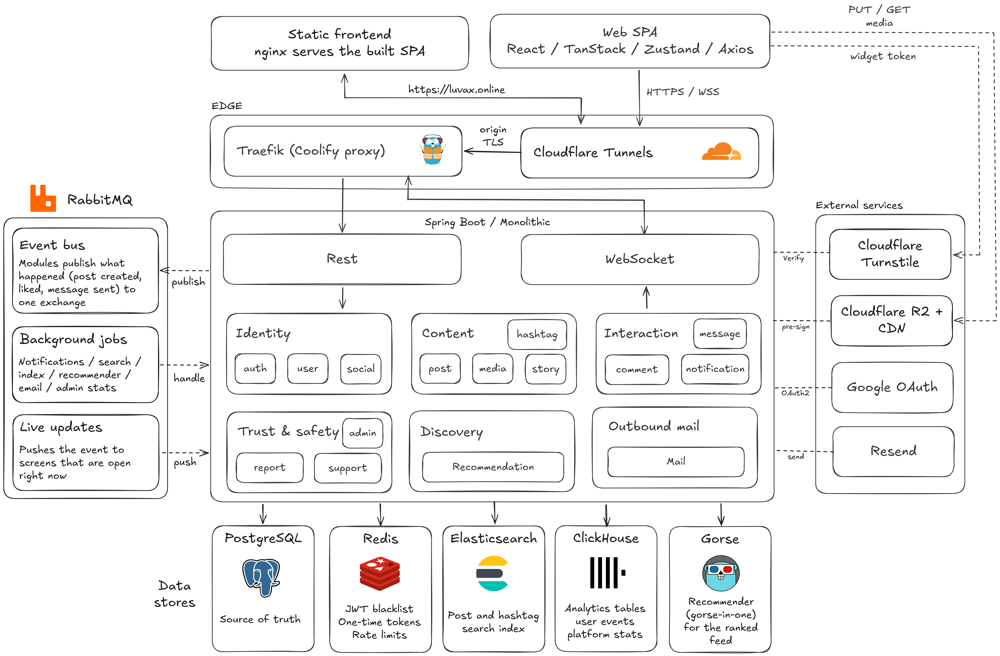
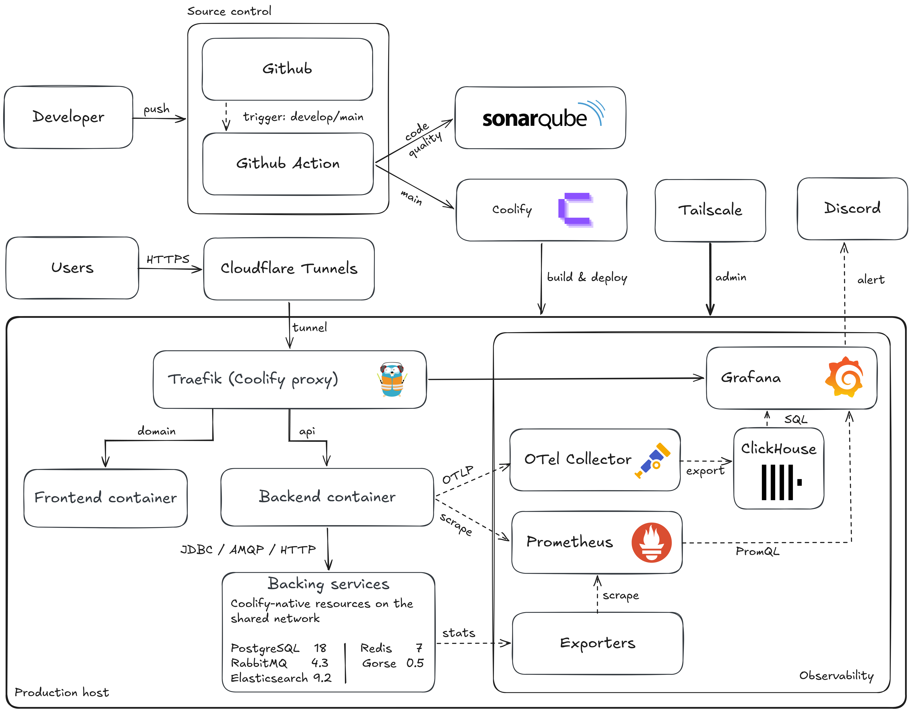

An Instagram-style social network with live comments, messages and a ranked feed.

[Backend](https://github.com/luvax-social/backend) ·
[Frontend](https://github.com/luvax-social/frontend) ·
[Observability](https://github.com/luvax-social/observability)

[](https://github.com/luvax-social/frontend/actions/workflows/ci-fe.yml)
[](https://github.com/luvax-social/backend/actions/workflows/sonarcloud.yml)
[](https://sonarcloud.io/summary/new_code?id=zentech-graduation_luvax)

## About

In Luvax, people keep a public or private profile, follow each other, and share photo, video
and carousel posts with likes, saves and threaded comments. Stories last 24 hours, and direct
messages support one-to-one and group conversations. Hashtags, search and a ranked feed handle
discovery. Moderators work from an admin panel that covers reports, a discipline ladder,
support tickets and appeals.

This repository is the workspace that ties the project together. It holds no application
code. Each part of the system lives in its own repository, included here as a Git submodule:

| Path | Repository | Contents |
|------|------------|----------|
| `backend/` | [luvax-social/backend](https://github.com/luvax-social/backend) | Spring Boot API, database migrations, RabbitMQ topology, local infrastructure |
| `frontend/` | [luvax-social/frontend](https://github.com/luvax-social/frontend) | React single-page app, including the admin panel |
| `observability/` | [luvax-social/observability](https://github.com/luvax-social/observability) | OpenTelemetry Collector, ClickHouse, Prometheus and Grafana configuration |

The root repository tracks the submodule pointers, the shared agent rules in
[`.claude/rules/`](.claude/rules/) and the Windows launcher [`start-app.bat`](start-app.bat).

## Architecture

### How a request flows through the system

[](docs/runtime.png)

Public traffic enters through a Cloudflare Tunnel, so the production host exposes no ports to
the internet. The tunnel hands each request to Traefik, the proxy Coolify runs, which routes by
host name. `luvax.online` goes to an nginx container that serves the built single-page app.
`api.luvax.online` goes to the backend.

The backend is a single Spring Boot application (a modular monolith). Its fifteen modules fall
into six groups:

| Group | Modules |
|-------|---------|
| Identity | `auth`, `users`, `social` |
| Content | `post`, `media`, `story`, `hashtag` |
| Interaction | `comment`, `message`, `notification` |
| Trust and safety | `report`, `admin`, `support` |
| Discovery | `recommendation` |
| Outbound mail | `mail` |

The browser talks to the backend in two ways. Ordinary requests go to the REST API under
`/api/v1`, authenticated with a short-lived JWT held in memory and refreshed through an HttpOnly
cookie. Live screens (comments, messages, notifications and post updates) hold a STOMP
WebSocket connection on `/ws/*`, opened with a one-time ticket instead of the access token.

When something happens, such as a new post, a like or a sent message, the module that owns it
publishes an event to RabbitMQ. That event bus feeds two kinds of work. Background jobs create
notifications, keep the search index current, send feedback to the recommender, deliver email
and update admin statistics. Live updates push the event straight to the screens that are open
at that moment, which is why comments and messages appear without polling. A message that can
never be processed goes to a dead-letter exchange.

PostgreSQL is the source of truth. Every other store can be rebuilt from it or from live
traffic:

| Store | Holds |
|-------|-------|
| PostgreSQL 18 | All canonical data; counters such as likes and followers are maintained by triggers |
| Redis 7 | Token blacklist, one-time email and reset tokens, WebSocket tickets, rate limits |
| Elasticsearch 9.2 | Search index for posts and hashtags |
| ClickHouse | Analytics tables (`user_events`, `platform_stats`) |
| Gorse 0.5 | Recommender behind the ranked feed |

The backend also relies on four external services. Cloudflare Turnstile checks for bots on
login, registration, password reset and the support form, and the backend verifies each token
server-side. Google OAuth provides sign-in with Google. Resend sends all email. Cloudflare R2
stores media: the backend signs an upload URL, and the browser uploads the file directly, so
media bytes never pass through the API.

### How code reaches production

[](docs/ops.png)

Every push and pull request to `develop` or `main` runs GitHub Actions. The frontend workflow
lints, runs the unit tests and builds. The backend workflow rejects duplicate Flyway migration
versions, then runs `mvnw verify` with SonarQube Cloud (SonarCloud) analysis.

Coolify deploys from `main`. Its GitHub App builds the backend and frontend Dockerfiles from
their own repositories, because Coolify does not initialise submodules. On the production host,
PostgreSQL, Redis, RabbitMQ and Elasticsearch run as Coolify-managed resources on a shared
network, and Gorse runs as a Docker Compose service. Administrators reach the host and the
Coolify dashboard over Tailscale only.

The observability stack runs on the same host:

- The backend exports traces and logs over OTLP to the OpenTelemetry Collector, which also
  collects container logs and writes everything to ClickHouse (traces kept 7 days, logs 14).
- Prometheus scrapes the backend's management port (8081), RabbitMQ, Gorse and a set of
  exporters for PostgreSQL, Redis, Elasticsearch, the host and its containers.
- Grafana reads from both and sends alerts to Discord. It is the only observability component
  reachable from outside, through `grafana.luvax.online` behind Cloudflare Access.

Telemetry is best effort. A missed export is not replayed, and none of it is a source of truth.

## Tech stack

| Area | Technology |
|------|------------|
| Frontend | React 19, Vite 8, Tailwind CSS 4, shadcn/ui, TanStack Query 5, Zustand 5, Axios, React Router 7, React Hook Form with Zod, STOMP.js |
| Backend | Java 21 with virtual threads, Spring Boot 4, Spring Security with JWT, Spring Data JPA, Flyway, Resilience4j |
| Messaging | RabbitMQ 4.3 |
| Data | PostgreSQL 18, Redis 7, Elasticsearch 9.2, ClickHouse 26.3 LTS, Gorse 0.5 |
| External services | Cloudflare Tunnel, Turnstile and R2; Google OAuth; Resend |
| Delivery | GitHub Actions, SonarQube Cloud, Docker, Coolify, Traefik, Tailscale |
| Observability | OpenTelemetry Collector, ClickHouse, Prometheus, Grafana, Discord alerts |
| Testing | JUnit 5 and Testcontainers (backend), Vitest and Playwright (frontend) |

## Documentation

| Document | Covers |
|----------|--------|
| [`STRUCT.md`](.claude/rules/STRUCT.md) | Workspace layout, module roster, RabbitMQ topology, Redis keys |
| [`GLOBAL_RULES.md`](.claude/rules/GLOBAL_RULES.md) | Data tiers, counter triggers, soft delete, media upload, commit conventions |
| [Backend module docs](https://github.com/luvax-social/backend/tree/main/docs/modules) | Data rules for each backend module, plus the OpenAPI and WebSocket guides |
| [Coolify runbook](https://github.com/luvax-social/backend/blob/main/docs/ops/COOLIFY_RUNBOOK.md) | How the production deployment is set up |
| [Observability runbook](https://github.com/luvax-social/observability/blob/main/docs/production-deployment-runbook.md) | Deploying and operating the observability stack |

## Quick start

Requirements:

- Git
- Docker Desktop
- Java 21 JDK
- Node.js 24 and npm

1. Clone the workspace with its submodules:

   ```bash
   git clone --recurse-submodules https://github.com/luvax-social/social-media-platforms.git
   cd social-media-platforms
   ```

2. Create the environment files from their examples. The comments in each `.env.example`
   explain every variable.

   ```bash
   cp backend/.env.example backend/.env
   cp frontend/.env.example frontend/.env
   ```

   > Important: the backend will not start without a valid `RESEND_API_KEY` in `backend/.env`.
   > Resend is its only mail transport, so local runs send real email through your Resend account.

3. Install the frontend dependencies:

   ```bash
   cd frontend && npm ci && cd ..
   ```

4. On Windows, double-click `start-app.bat`. It starts the infrastructure containers, then opens
   one window for the backend and one for the frontend.

Open the app at `http://localhost:5173`. The API listens on `http://localhost:8080/api/v1`, and
the `dev` profile serves Swagger UI at `http://localhost:8080/swagger-ui`.

### Starting the services by hand

On macOS or Linux, or without the launcher:

```bash
cd backend
docker compose up -d          # PostgreSQL, Redis, RabbitMQ, Elasticsearch, Gorse
./mvnw spring-boot:run        # API on http://localhost:8080

cd ../frontend
npm run dev                   # app on http://localhost:5173
```

### Running the observability stack locally

The stack is optional for development. Start it after the backend's containers are up:

```bash
docker compose -f observability/compose.local.yaml --profile observability up -d
```

Grafana is then on `http://localhost:3000` and Prometheus on `http://localhost:9090`.

### Running the tests

```bash
cd backend && ./mvnw verify               # unit and integration tests; Testcontainers needs Docker
cd frontend && npm run lint && npm test   # ESLint and the Vitest unit suite
```

## Contributing

Commit each change to the repository it belongs to: backend changes in `backend/`, frontend
changes in `frontend/`, and so on. The root repository only records which commit of each
submodule it points to, plus workspace-level rules. Open pull requests against `develop` or
`main` in the sub-project's repository, where CI runs. Commit messages carry no AI attribution.

To report a bug or ask a question, open an issue in the repository the problem belongs to:
[backend](https://github.com/luvax-social/backend/issues),
[frontend](https://github.com/luvax-social/frontend/issues) or
[observability](https://github.com/luvax-social/observability/issues).
